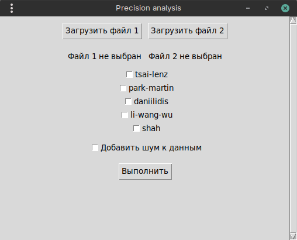
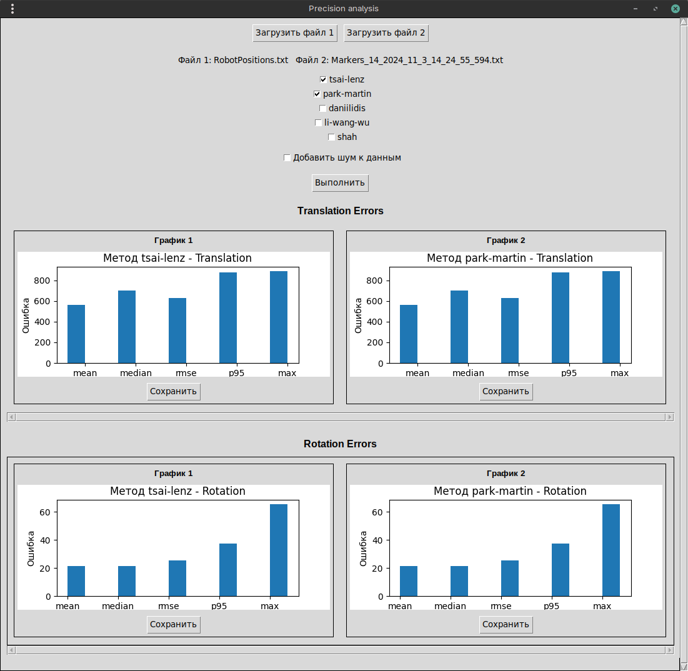
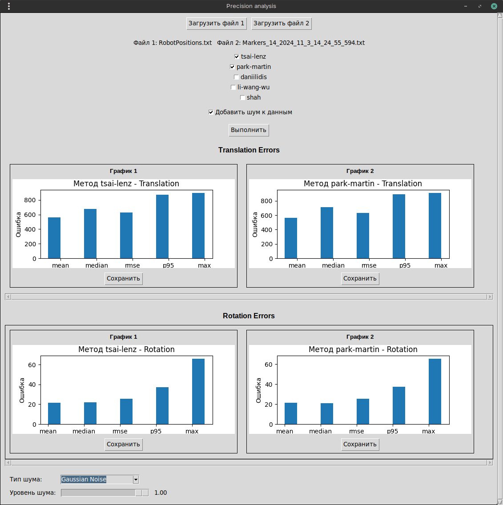

# Precision Analysis — Руководство пользователя
Это графическое приложение (GUI) предназначено для сравнения классических методов решения задач вида AX = XB и AX = YB.
Программа принимает на вход файлы с данными точек в формате id, X, Y, Z, RZ, RY, RX (в миллиметрах и градусах; углы заданы в порядке ZYX).

## Проблематика

Задачи калибровки вида **AX = XB** и **AX = YB** широко применяются в робототехнике, компьютерном зрении и системах навигации (например, hand–eye calibration и robot–camera calibration).  
На практике их решение связано с рядом принципиальных трудностей.

### Основные проблемы:

* **Наличие шума в измерениях**  
  Реальные данные содержат погрешности, обусловленные неточностями сенсоров, ошибками трекинга, калибровки камер, энкодеров и систем локализации. Эти ошибки проявляются как в трансляции, так и во вращении.

* **Чувствительность алгоритмов к типу шума**  
  Разные методы по-разному реагируют на некоррелированный случайный шум (Gaussian Noise) и коррелированные искажения (Perlin Noise), что может приводить к существенно различным результатам при одинаковых исходных данных.

* **Устойчивость к выбросам и малому числу измерений**  
  Некоторые алгоритмы требуют большого количества пар преобразований для устойчивой работы и чувствительны к выбросам, что ограничивает их применимость в практических сценариях.

* **Сложность объективного сравнения методов**  
  В научных публикациях методы часто сравниваются на синтетических или специализированных датасетах, что затрудняет выбор подходящего алгоритма для конкретной прикладной задачи.

Цель данного приложения — предоставить единый инструмент для объективного сравнения классических методов решения задач **AX = XB** и **AX = YB** на одинаковых данных, с возможностью контролируемого добавления шума и оценки точности по набору статистических метрик.



## Добавление шума к данным
В приложение добавлена возможность тестирования методов на зашумленных данных. Это позволяет оценить устойчивость алгоритмов к различным типам искажений.
## Типы доступного шума:
* Perlin Noise — плавный "природный" шум, имитирующий органичные искажения (дрожание камеры, плавное движение)
* Gaussian Noise — классический гауссовский шум с нормальным распределением (случайные погрешности сенсоров)
## Как использовать:
1. Загрузите два файла как обычно

2. Установите чекбокс "Добавить шум к данным"
3. Выберите тип шума из выпадающего списка
4. Отрегулируйте уровень шума с помощью ползунка (0.0 - нет шума, 1.0 - максимальный шум)
5. Нажмите "Выполнить" для анализа

## Принцип работы:
При включении шума данные из файла 2 будут модифицированы перед анализом.
Файл 1 остаётся неизменным, что позволяет оценить влияние шума на точность 
## Используемые методы
Приложение реализует и сравнивает пять классических методов:
* tsai-lenz [https://kmlee.gatech.edu/me6406/handeye.pdf]
* park-martin [https://ieeexplore.ieee.org/abstract/document/326576]
* daniilidis [https://journals.sagepub.com/doi/abs/10.1177/02783649922066213]
* li-wang-wu [https://academicjournals.org/journal/IJPS/article-full-text-pdf/20DFAEA30999]
* shah [https://asmedigitalcollection.asme.org/mechanismsrobotics/article-abstract/5/3/031007/474841/Solving-the-Robot-World-Hand-Eye-Calibration]
## Метрики оценки
* mean (среднее)
* median (медиана)
* rmse (корень из среднеквадратичной ошибки)
* p95 (95-й процентиль)
* max (максимальная ошибка)
## Как запустить программу
Чтобы запустить программу достаточно открыть в каталоге app нужный фаил в соответстии с вашей системой
### Для Windows:
app.exe
### Для Linux:
app
## Инструкция по сборке
Если вы решили собрать проект сами то:
1. Убедитесь, что у вас установлен Python
2. Создайте виртуальное окружение, если его нет
```bash
python -m venv venv
```
3. Активируйте виртуальное окружение:
### Для Windows (PowerShell или CMD):
```bash
venv\Scripts\activate
```
### Для Linux/Mac:
```bash
source venv/bin/activate
```
4. Установите все нужные зависимости одной командой:
```bash
pip install -r requirements.txt
```
5. Запустите приложение командой из корня проекта:
```bash
python .\src\app.py

```
## Инструкция по использованию 
### Загрузка файлов
* При запуске откроется окно приложения.
* Выберите 2 файла с точками в пространстве в указанном формате, используя кнопки "Загрузить файл 1" и "Загрузить файл 2".
* После успешной загрузки пути к выбранным файлам отобразятся рядом с кнопками.
### Выбор методов и запуск анализа
* Отметьте чекбоксы для методов, которые хотите применить. Можно выбрать один или несколько.
* Нажмите кнопку "Выполнить" для запуска вычислений и построения графиков.
### Просмотр графиков
* Графики точности (для трансляции и вращения) отобразятся в соответствующих разделах окна с возможностью горизонтальной прокрутки.
* Каждый график сопровождается заголовком и кнопкой "Сохранить" для экспорта изображения в PNG или PDF.
## Технические детали
* Приложение написано на Python с использованием Tkinter для GUI и matplotlib для визуализации графиков.
* Для генерации шума используются библиотеки noise (Perlin Noise) и scipy (Gaussian Noise).
* Приложение написано на Python с использованием Tkinter для GUI и matplotlib для визуализации графиков.
* Для генерации шума используются библиотеки noise (Perlin Noise) и scipy (Gaussian Noise).